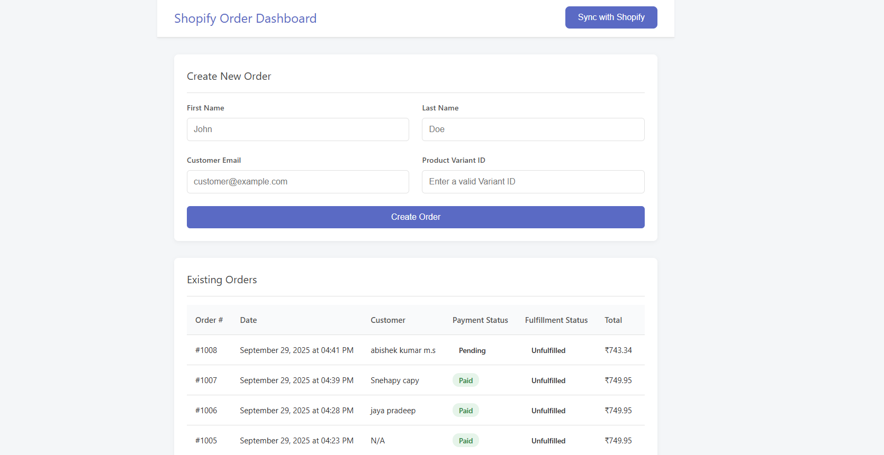

Shopify Order Management Dashboard
View on GitHub

A full-stack web application built with Vue.js, Node.js, Express, and MongoDB to interact with the Shopify Admin API. This dashboard allows users to sync, view, and create Shopify orders through a clean, user-friendly interface.

This project demonstrates a practical integration with a major third-party API, showcasing the ability to handle data synchronization, secure authentication, and full-stack communication.

Features
Order Synchronization: Pulls all orders from a Shopify store and saves them to a local MongoDB database.

Order Display: Displays synced orders in a clean, sorted, and easy-to-read table.

Create Orders: A dedicated form to create new orders with customer details directly in Shopify via the backend.

Responsive UI: A simple and clean user interface that is easy to navigate.

Tech Stack
Backend
Node.js: JavaScript runtime environment.

Express.js: Web framework for creating the API.

MongoDB: NoSQL database for storing order data.

Mongoose: ODM for modeling and interacting with MongoDB.

Axios: For making HTTP requests to the Shopify API.

dotenv: For managing environment variables and secret keys.

CORS: For enabling cross-origin requests between frontend and backend.

Frontend
Vue.js (v3): Progressive JavaScript framework for the user interface.

Vite: Modern frontend build tool.

Axios: For making API requests from the frontend to the backend.

Setup and Installation
To run this project locally, you will need to set up both the backend and the frontend.

1. Backend Setup
# Navigate into the backend directory
cd backend

# Install dependencies
npm install

# Create a .env file in the root of the /backend folder
# and add your credentials:
MONGO_URI=mongodb://localhost:27017/shopify_orders
SHOPIFY_SHOP_URL=your-store-name.myshopify.com
SHOPIFY_ACCESS_TOKEN=your-admin-api-access-token
PORT=5001

# Start the backend server
npm run dev

The backend will be running at http://localhost:5001.

2. Frontend Setup
# Open a new terminal and navigate into the frontend directory
cd frontend

# Install dependencies
npm install

# Start the frontend development server
npm run dev

The frontend will be running at http://localhost:5173. Open this URL in your browser to use the application.
